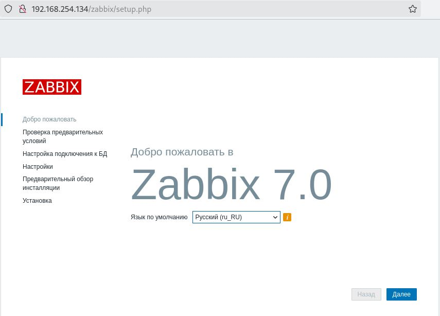
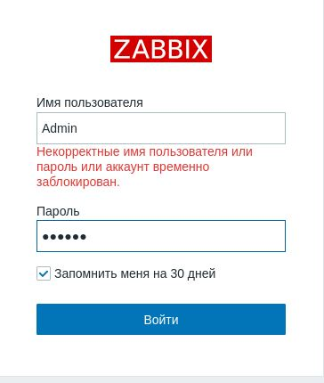
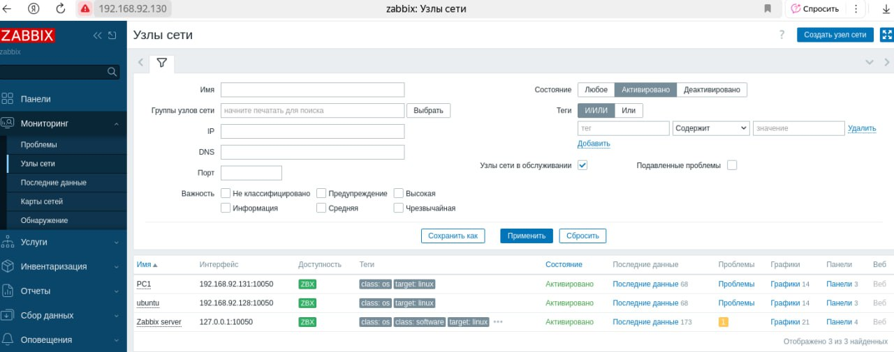
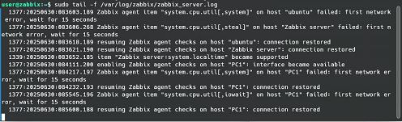
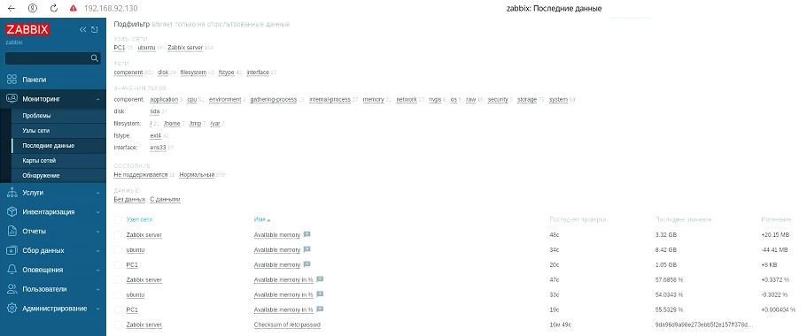

# Домашнее задание к занятию "`Система мониторинга Zabbix`" - `Толмачев Алексей`

### Дополнительные материалы, которые могут быть полезны для выполнения задания

---

### Задание 1

`Установите Zabbix Server с веб-интерфейсом.`

###### Процесс выполнения

1. Выполняя ДЗ, сверяйтесь с процессом отражённым в записи лекции.
2. Установите PostgreSQL. Для установки достаточна та версия, что есть в системном репозитороии Debian 11.
3. Пользуясь конфигуратором команд с официального сайта, составьте набор команд для установки последней версии Zabbix с поддержкой PostgreSQL и Apache.
4. Выполните все необходимые команды для установки Zabbix Server и Zabbix Web Server.

#### Решение 1

``

1. `Установили Zabbix`
   

2. `Вход под администратором`
   

```
wget https://repo.zabbix.com/zabbix/7.0/debian/pool/main/z/zabbix-release/zabbix-release_latest_7.0+debian12_all.deb
dpkg -i zabbix-release_latest_7.0+debian12_all.deb
apt update
apt install zabbix-server-pgsql zabbix-frontend-php php8.2-pgsql zabbix-apache-conf zabbix-sql-scripts zabbix-agent2
apt install zabbix-agent2-plugin-mongodb zabbix-agent2-plugin-mssql zabbix-agent2-plugin-postgresql
sudo -u postgres createuser --pwprompt zabbix
sudo -u postgres createdb -O zabbix zabbix
zcat /usr/share/zabbix-sql-scripts/postgresql/server.sql.gz | sudo -u zabbix psql zabbix
DBPassword=zabbix
systemctl restart zabbix-server zabbix-agent2 apache2
systemctl enable zabbix-server zabbix-agent2 apache2
```

---

### Задание 2

`Установите Zabbix Agent на два хоста`

###### Процесс выполнения

1. Выполняя ДЗ, сверяйтесь с процессом отражённым в записи лекции.
2. Установите Zabbix Agent на 2 вирт.машины, одной из них может быть ваш Zabbix Server.
3. Добавьте Zabbix Server в список разрешенных серверов ваших Zabbix Agentов.
4. Добавьте Zabbix Agentов в раздел Configuration > Hosts вашего Zabbix Servera.
5. Проверьте, что в разделе Latest Data начали появляться данные с добавленных агентов.

#### Решение 2

1. `Установили агент Zabbix`
   

2. `Проверка zabbix_log`
   

3. `Данные с агентов`
   

```
wget https://repo.zabbix.com/zabbix/7.0/debian/pool/main/z/zabbix-release/zabbix-release_latest_7.0+debian12_all.deb
dpkg -i zabbix-release_latest_7.0+debian12_all.deb
apt update
apt install zabbix-agent2
apt install zabbix-agent2-plugin-mongodb zabbix-agent2-plugin-mssql zabbix-agent2-plugin-postgresql
systemctl restart zabbix-agent2
systemctl enable zabbix-agent2
```

### Добавил в /etc/zabbix/zabbix-agent2.conf

```
Server=192.168.92.130
ServerActive=127.0.0.1
```

---
